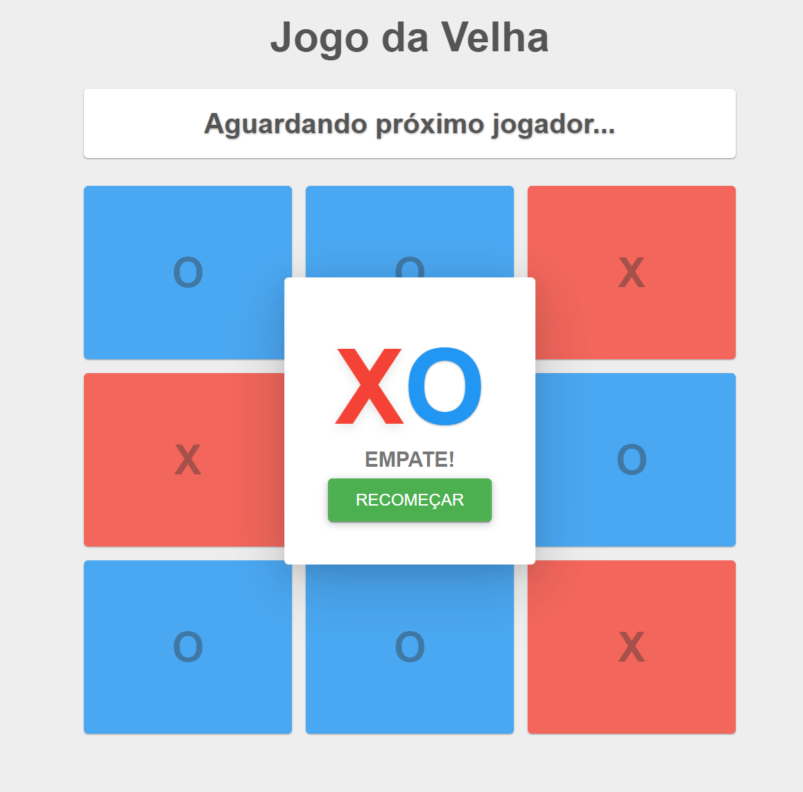

<h1 align="center"> Jogo da Velha </h1>

Excelente e lindo Jogo da Velha produzido para atender ao desafio do pdCafé.  
<a href="https://www.youtube.com/watch?v=kFXDcaUcOto" target="_blank">Estude esse projeto em formato de vídeo clicando aqui.</a>

  <a href="#-tecnologias">Tecnologias</a>&nbsp;&nbsp;&nbsp;|&nbsp;&nbsp;&nbsp;
  <a href="#-projeto">Projeto</a>&nbsp;&nbsp;&nbsp;|&nbsp;&nbsp;&nbsp;
  <a href="#-layout">Layout</a>&nbsp;&nbsp;&nbsp;|&nbsp;&nbsp;&nbsp;
  <a href="#memo-licença">Licença</a>

  

 

  

## 🚀 Tecnologias

Esse projeto foi desenvolvido com as seguintes tecnologias:

- HTML e CSS
- JavaScript
- Git e Github
- ReactJs
- NextJs

## 💻 Projeto

O jogo da velha ou jogo do galo ou três em linha é um jogo e/ou passatempo popular. É um jogo de regras extremamente simples, que não traz grandes dificuldades para seus jogadores e é facilmente aprendido.
Neste projeto implementei as regras do jogo utilizando o ReactJs para obter o resultado final.

- [Jogue e se divirta](https://tictactoe-5b52owx8i-elvisear.vercel.app/).

## 🔖 Layout

Você pode visualizar o fonte do projeto através [DESSE LINK](https://github.com/elvisear/tictactoe). 

## 📝 Licença

Esse projeto está sob a licença MIT.

---

Feito com ♥ by elvisear
